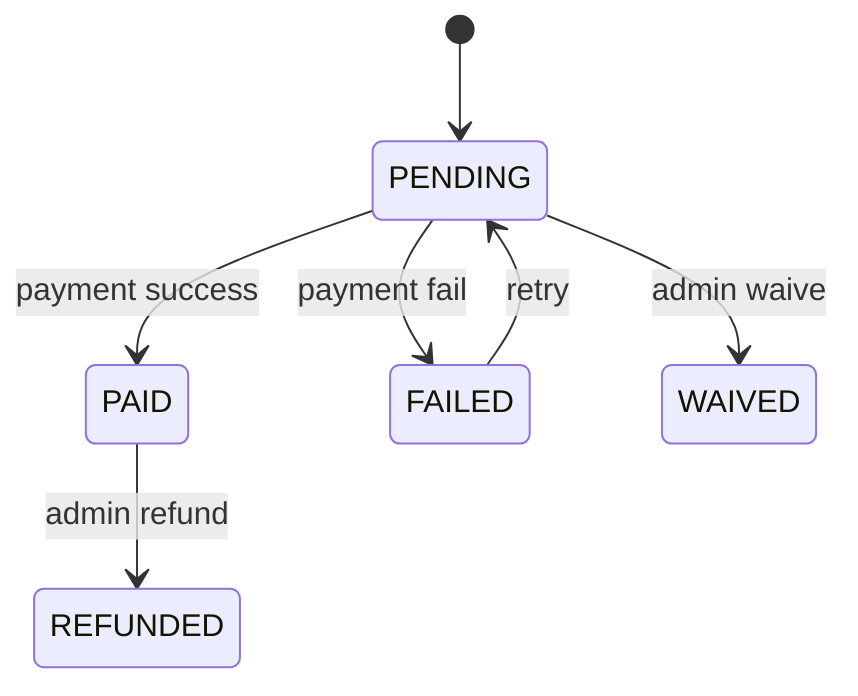

# Monetization Strategy

## Revenue streams (phased)

| Stream | Phase | Description |
|--------|-------|-------------|
| **Per-pickup flat fee** | v1 MVP | `WasteType.flatFeeMad` charged per request |
| **B2B contracts** | v1 stub / v2 | `Organization` volume pricing, monthly invoice |
| **Subscriptions** | v2 | Monthly pickup quota for households |

---

## v1 MVP: per-pickup pricing

### Fee calculation

At `POST /api/v1/pickups`:

```
feeAmountMad = WasteType.flatFeeMad  (snapshot on Pickup row)
```

Admin may override via `PATCH /api/v1/pickups/:id` (ADMIN only, audit logged) — optional v1.1.

### Example catalog (seed data)

| `WasteTypeCode` | `flatFeeMad` (MAD) |
|-----------------|-------------------|
| PLASTIC | 40.00 |
| PAPER | 35.00 |
| METAL | 50.00 |
| GLASS | 45.00 |
| ELECTRONIC | 80.00 |
| MIXED | 55.00 |

---

## Payment model alignment

### `Pickup.paymentStatus` (summary on pickup)

| Status | Meaning |
|--------|---------|
| `PENDING` | Pickup created, not paid |
| `PAID` | Successfully paid |
| `WAIVED` | Admin/comp promotion |
| `REFUNDED` | Money returned |
| `FAILED` | Payment attempt failed |

### `Payment` record (transaction detail)

| Field | Purpose |
|-------|---------|
| `provider` | `CASH`, `CMI`, `STRIPE`, `MANUAL` |
| `status` | Same enum as payment lifecycle |
| `externalId` | CMI/Stripe transaction id |
| `amountMad` | Should match `pickup.feeAmountMad` |

### State transitions



**Rule:** Pickup `paymentStatus` syncs when latest `Payment.status` reaches terminal state.

---

## Payment flows (v1)

### Cash on collection (default MVP)

1. Pickup `COMPLETED` by collector
2. Collector marks cash received → `POST /api/v1/pickups/:id/payments` `{ "provider": "CASH" }`
3. Dispatcher/ADMIN can confirm → `PAID`

### CMI (Morocco card — stub v1)

1. `POST /payments` returns `{ "redirectUrl": "..." }` (mock in dev)
2. Webhook v2: `POST /api/v1/webhooks/cmi` verifies signature → `PAID`

### Stripe (v2 international)

For diaspora or card-preferred users; not MVP.

---

## B2B (v1 stub)

- `Organization` linked to `User.organizationId`
- Pickups tagged with org for reporting
- Invoicing: export CSV of completed pickups monthly (v1.1 script)
- Volume discount: `Organization.discountPercent` field (v2 schema)

---

## Subscriptions (v2 schema preview)

```prisma
model Subscription {
  id             String   @id @default(uuid())
  userId         String
  planCode       String   // HOME_MONTHLY_4
  pickupsPerMonth Int
  priceMad       Decimal
  status         String   // ACTIVE, CANCELLED
  currentPeriodEnd DateTime
}
```

Not implemented in v1 — do not create table until v2.

---

## Refunds & disputes

- Only `ADMIN` can set `REFUNDED`
- Require `cancellationReason` or note in `AuditLog`

---

## Tax & invoicing (Morocco)

- Display prices **TTC** (VAT included) on booking review
- B2B invoices: company name + `taxId` from `Organization` (v2 PDF)

---

## KPIs tied to monetization

See `analytics-reporting.md`:

- `revenueMad` = sum of `Payment.amountMad` where `status = PAID`
- `averageOrderValueMad`

---

## Monetization checklist

- [ ] Fee snapshotted at pickup creation
- [ ] Payment provider enum matches Prisma
- [ ] Cash flow documented for collectors
- [ ] No subscription code in v1 migrations
