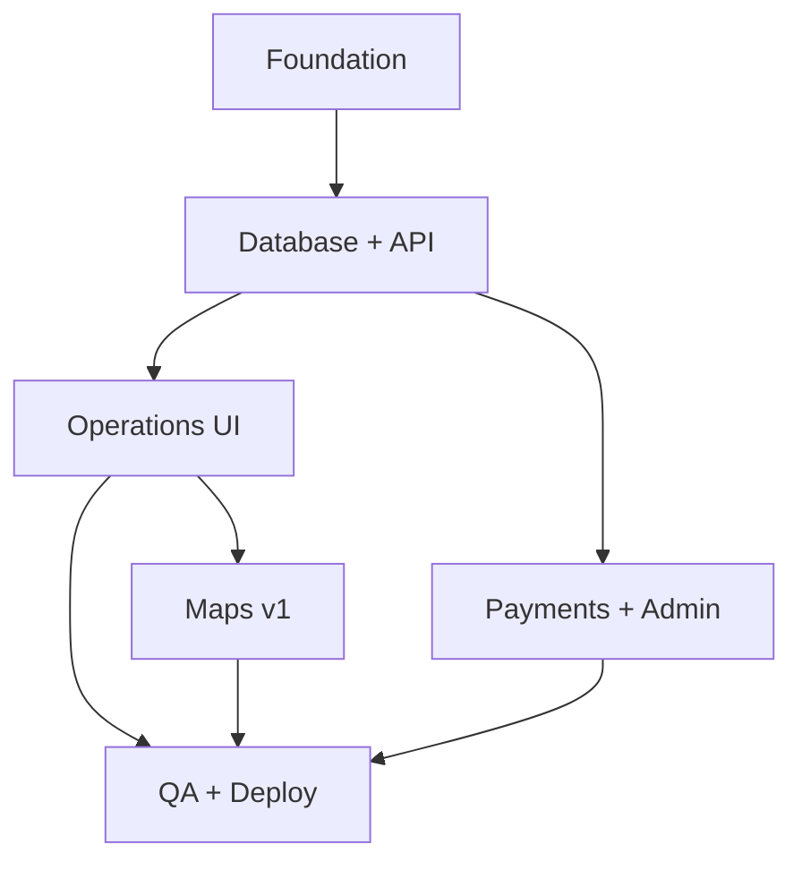

# Project Roadmap

Aligned with Phase 3 implementation order. Each phase has exit criteria before the next starts.

---

## Phase A — Foundation (Week 1–2)

| Task | Owner doc | Exit criteria |
|------|-----------|---------------|
| Init Next.js 15 + TS strict | `coding-standards.md` | `npm run build` passes |
| Docker Compose postgres + redis | `devops-engineer.md` | `docker compose up` healthy |
| Prisma schema + migrate + seed | `prisma-schema-guide.md` | Seed users login |
| Auth.js credentials + sessions | `security-engineer.md` | Login/logout works |
| RBAC middleware + permissions lib | `security-engineer.md` | Role redirect works |
| i18n skeleton fr/ar/en | `localization-guide.md` | Locale switch works |

---

## Phase B — Database & core API (Week 2–3)

| Task | Exit criteria |
|------|---------------|
| Address CRUD API | Geocode + city validation |
| Waste types API + admin patch | Catalog on landing |
| Pickup create/list/detail | USER scoped |
| Status transitions + history | Matrix enforced |
| Assign collector endpoint | DISPATCHER flow |
| Audit log on sensitive actions | Rows written |

---

## Phase C — Operations UI (Week 3–4)

| Task | Exit criteria |
|------|---------------|
| Landing + auth pages | CP-1 E2E starts |
| Customer dashboard + booking wizard | CP-1 green |
| Dispatcher queue + assign | CP-2 green |
| Collector route + status buttons | CP-3 green |
| Leaflet map components | OSM attribution |

---

## Phase D — Payments & admin (Week 4–5)

| Task | Exit criteria |
|------|---------------|
| Payment record (CASH) | CP-3 payment PAID |
| Admin users + waste fees | CP-4 green |
| Admin stats endpoint + dashboard | KPIs show |
| Email notifications | 3 templates sent (mock OK) |

---

## Phase E — Quality & deploy (Week 5–6)

| Task | Exit criteria |
|------|---------------|
| Unit + integration tests | 70% server coverage |
| E2E critical paths | CP-1–5 green |
| CI pipeline | PR checks pass |
| Staging deploy | Health check OK |
| Security checklist | `security-engineer.md` |

---

## v1.1 (post-MVP)

- Redis job queue for email
- SMS via Infobip
- Proof photo upload (S3/R2)
- CMI payment webhook
- Collector manual GPS
- Daily analytics rollup table
- Email verification gate

---

## v2

- Multi-city `ServiceZone` model
- OSRM + route optimization
- JWT mobile API
- Subscriptions
- B2B invoicing PDF
- Darija content layer
- WebSocket live tracking

---

## Dependency graph

---

## Definition of Done (v1 release)

- [ ] All MVP scope items in `README.md` implemented
- [ ] Documentation enums match Prisma schema
- [ ] CP-1 through CP-5 pass in CI
- [ ] Staging demo with 2 collectors, 10+ pickups
- [ ] Privacy policy FR/AR published

---

## Risk register

| Risk | Mitigation |
|------|------------|
| Nominatim rate limits | Server cache + self-host plan |
| Public API abuse | Session auth + rate limits |
| Scope creep (subscriptions) | Defer to v2 per this roadmap |
| Cash payment disputes | Admin audit + payment status |
