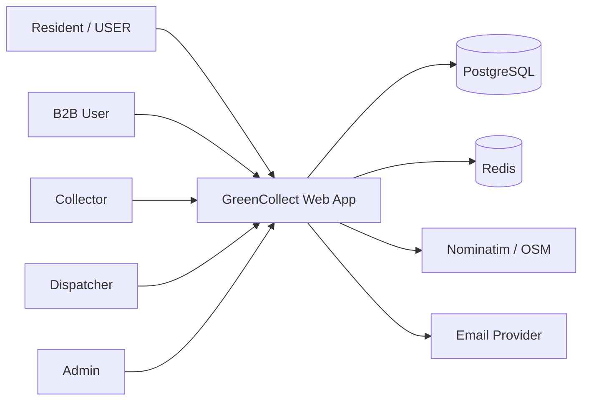
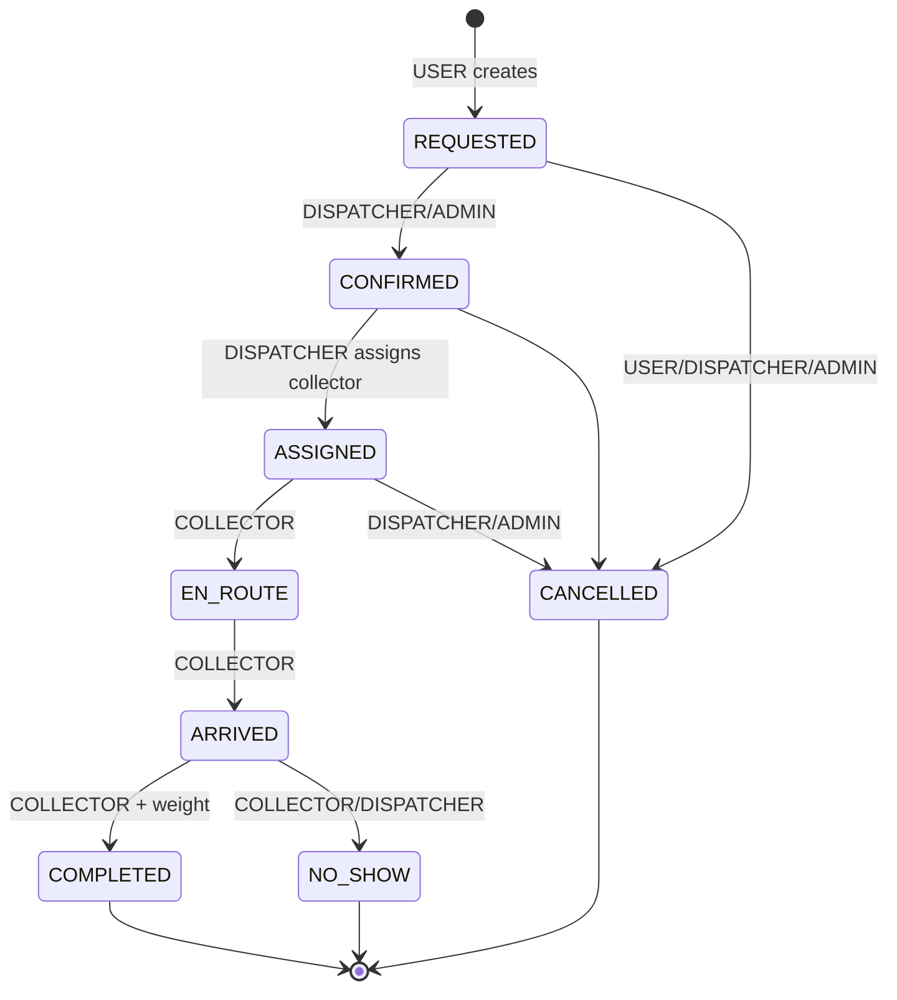

# Software Architect Agent

## Mission

Define and maintain the **GreenCollect** system architecture: modular monolith on Next.js, PostgreSQL, clear module boundaries, and a path to scale without premature microservices.

## System context (C4 Level 1)



## Container diagram (C4 Level 2)

| Container | Responsibility | Technology |
|-----------|----------------|------------|
| **Web Application** | UI, API Route Handlers, auth, business logic | Next.js 15 |
| **PostgreSQL** | System of record | Prisma ORM |
| **Redis** | Session cache, rate limits, job queue (v1.1) | ioredis |
| **Nominatim** | Forward/reverse geocoding | HTTP (self-hosted or public with throttling) |

No separate API gateway in v1 — Next.js serves both UI and `/api/v1`.

## Module boundaries

```
src/server/
├── auth/           # session helpers, credential verification
├── users/          # profile, addresses
├── pickups/        # lifecycle, assignment, status transitions
├── routes/         # collector daily routes (manual order v1)
├── payments/       # fee calculation, payment records
├── notifications/  # email enqueue
├── geo/            # geocode, distance helpers
└── analytics/      # read-only aggregations
```

**Rules:**

- Route Handlers are thin: parse → validate (Zod) → call service → map response.
- Services never import React; no DB access from Client Components.
- Cross-module calls go through services, not direct Prisma from random handlers.

## Core domain: Pickup lifecycle

State machine (canonical enum `PickupStatus`):



`DRAFT` is optional client-side only; server creates at `REQUESTED`.

## Architecture Decision Records (ADRs)

### ADR-001: Modular monolith (not microservices)

**Status:** Accepted  
**Context:** Small team, Morocco MVP, need speed.  
**Decision:** Single Next.js deployable with internal service modules.  
**Consequences:** Simple ops; extract `payments` or `routing` later if needed.

### ADR-002: Auth.js database sessions (not JWT for web MVP)

**Status:** Accepted  
**Context:** Web-first product; JWT adds refresh/blacklist complexity.  
**Decision:** Auth.js v5 with Prisma `Session` + `Account` models; `getServerSession()` on API routes.  
**Consequences:** Mobile native app in v2 may add `/api/v1/auth/token` JWT layer.

### ADR-003: UUID primary keys

**Status:** Accepted  
**Reason:** Safe merging, no enumeration, distributed-friendly.

### ADR-004: Geospatial storage as Decimal lat/lng (not PostGIS in v1)

**Status:** Accepted  
**Context:** MVP map pins and haversine distance; PostGIS adds ops complexity.  
**Decision:** `latitude Decimal(9,6)`, `longitude Decimal(9,6)` on `Address`.  
**Future:** PostGIS `geography(Point,4326)` when zone polygons are required.

### ADR-005: Route optimization deferred

**Status:** Accepted  
**v1:** Dispatcher manually orders pickups on a `Route`.  
**v2:** Background job with OSRM + heuristic optimizer.

## Scalability path

| Stage | Users | Approach |
|-------|-------|----------|
| MVP | &lt; 5k | Single Next.js instance, connection pooling (PgBouncer) |
| Growth | 5k–50k | Redis cache for session + hot reads; read replica for analytics |
| Scale | 50k+ | Horizontal Next.js replicas, dedicated worker for jobs, CDN for static |

## Integration contracts

| Integration | Owner module | Doc reference |
|-------------|--------------|---------------|
| REST API | All modules | `api-contracts.md` |
| Database | All modules | `prisma-schema-guide.md` |
| RBAC | `auth` + middleware | `security-engineer.md` |
| Maps | `geo` | `maps-routing-system.md` |
| Payments | `payments` | `monetization-strategy.md` |
| Metrics | `analytics` | `analytics-reporting.md` |

## Non-functional requirements

| NFR | Target (MVP) |
|-----|----------------|
| API p95 latency | &lt; 500ms excluding geocode |
| Uptime | 99.5% (single region) |
| RPO | 24h (daily DB backup) |
| RTO | 4h |
| Data residency | EU or Morocco region when available; document in privacy policy |

## Architect agent checklist

- [ ] New feature has module owner under `src/server/`
- [ ] Pickup transitions logged in `PickupStatusHistory`
- [ ] No new enum without updating Prisma + API + security matrix
- [ ] External HTTP calls have timeout (5s) and circuit-breaker pattern for Nominatim
